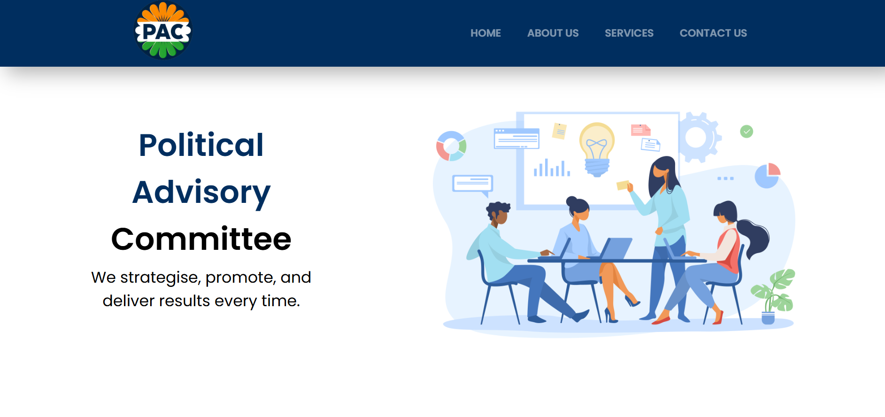

# Political-Advisory-Committee

PAC is a political consultancy which provides services such as Social Media Managament, Opinion Poll, Strategy Formulation, Door-to-Door Campaign, etc. This Website build by Ankush Raj Mahe Yam - ARMY.

**Link to project:**  https://ankushrajmaheyam.github.io/Political-Advisory-Committee

## How It's Made:

**Tech used:** HTML, CSS, JavaScript
It is a static and responsive website. The client gave me the freedom to design logo and the website layout. The contact form sends the form details to the client's email without using backend technologies.

## Optimizations
I took the liberty to add content to privacy policy, terms and consitions pages that is relevant to the client's business. Implemented hamburger menu to toggle the nav bar in mobile version of the website. 
## Lessons Learned:

Used IS pseduo class to make the code more compact. Working with % and rem is fun. Removed unused and unnecessary code. Also, created the same website using react components, props, etc to make the code reusuable and efficient.

## Examples:
Take a look at these couple examples that I have in my own portfolio:

**ARMY Website:** https://ankushrajmaheyam.github.io/ARMY

**Portfolio:** https://ankushrajmaheyam.github.io/AboutMe

## About Me  

Hi, I’m **Ankush Raj** or **Ankush Raj Mahe Yam** **(ARMY)**, an aspiring software developer. I’m passionate about coding and enjoy sharing my learning journey to help others grow.  

🌟 Connect with me:  
- **Google Search:** [Ankush Raj Mahe Yam](https://www.google.com/search?q=ankush+raj+mahe+yam)  
- **LinkedIn:** [Ankush Raj Mahe Yam](https://linkedin.com/in/ankushrajmaheyam)  
- **GitHub:** [Ankush Raj Mahe Yam](https://github.com/AnkushRajMaheYam)  
- **Instagram:** [@AnkushRajaMaheYam](https://instagram.com/AnkushRajaMaheYam)  
- **Facebook:** [Ankush Raj Mahe Yam](https://facebook.com/AnkushRajMaheYam)  

